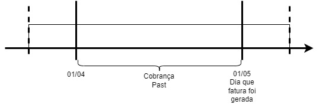
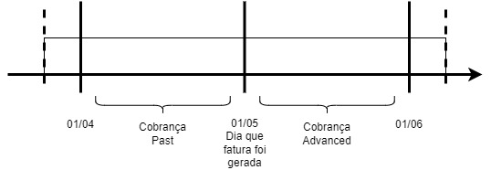
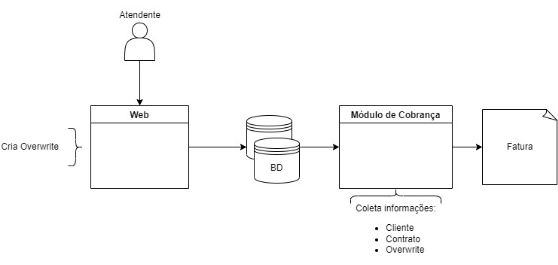

**FACULDADE DE TECNOLOGIA DE SÃO JOSÉ DOS CAMPOS**

**FATEC PROFESSOR JESSEN VIDAL**

**VITOR HENRIQUE DA SILVA PEREIRA**

**RECURRING CHARGES BASED ON DEDICATED START & END DATES**

Orientador: Diogo Branquinho Ramos

São José dos Campos

2022

1. # **INTRODUÇÃO**
Dentro do sistema de telefonia é recorrente o cenário da qual uma taxa e/ou uma promoção é configurada para uma data inicial e não contendo uma data final, mas sim é configurada a quantidade de vezes que essa alteração (Overwrite) de valor será cobrado na fatura (Number of times to bill) ou apenas *setado* para infinito. Este cenário ocasionava uma insatisfação do qual o cliente (telefonia) poderia ter vários overwrites no período de uma única fatura, podendo uma das taxas ser finalizado em um dia do mês e a outra taxa começar no mesmo mês.

1. ## **Definição do problema**
Neste projeto foi apresentado o requisito de um sistema de cobrança de telefonia do qual uma promoção e/ou taxa de um serviço tem sua data de início e contagem de quantas faturas serão aplicadas à essa substituição de valor (Overwrite). As cobranças recorrentes são usadas para aplicar um valor que é pago uma vez em cada período por um serviço prestado ao cliente final.

Foi requerido o aprimoramento para permitir a substituição de um valor de cobrança recorrente original que é válido por um período definido por uma data de início e uma data de término.

A falta de uma data final para o overwrite afetava principalmente em cenários de serviços prorrateados, onde uma fatura deveria informar o valor de um overwrite dentro da data setada e o valor (Amount) original fora do intervalo de substituição.

Dentro desse escopo existe dois tipos de cobrança:

- Past-Charge
- Advanced Chagr

E dois tipos de aplicação para essas charges:

- Prorated
- Non-Prorated

Onde uma past charge pode ser prorrateado ou não prorrateado, assim como, um advanced charge pode ser prorrateado ou não prorrateado.

1. ### **Past Charge e Advanced Charge**
As Charges Past são as cobranças de um serviço de um mês que já foi contabilizado, por exemplo, um contrato de telefonia foi criado dia 01 de julho com serviço de telefonia básico do tipo past, custando 10 reais de cobrança pelo serviço.

Após um mês (01 de agosto) será rodado e calculado uma cobrança (Billing) deste contrato. Por esse serviço ser past a cobrança de 10 reais virá do dia 01 de julho ao dia 31 de julho

No caso de serviços advanced, num cenário igual ao anterior, de um contrato criado dia 01 de julho com um serviço advanced de 10 reais, quando o billing for rodado e calculado no dia 01 de agosto haverá detalhado na fatura a past charge do mês de julho assim como no cenário anterior, porém, neste teste irá conter já uma charge do dia 01 até dia 31 de agosto constando os 10 reais do serviço de telefonia que na próxima rodada de billing pode ser corrigido ou não por alguma condição terceira.

1. ### **Non-Prorated e Prorated**
Prorating é o ato de calcular e aplicar cobranças recorrentes em proporção ao tempo em que um serviço está ativo ou ao tempo em que a cobrança foi válida durante um período de cobrança. Quando um intervalo de cobrança individual para cobranças recorrentes é definido para um serviço, o prorating é baseado em quanto tempo o serviço está ativo durante esse intervalo em vez de um período de cobrança. Os princípios para prorating, no entanto, são basicamente os mesmos, quer as cobranças sejam baseadas em um período de cobrança ou em um intervalo de cobrança individual.

Os exemplos a seguir descrevem quando o carregamento proporcional pode ser aplicado:

`    `Uma alteração do plano de tarifas é realizada durante um período de cobrança. Se a cobrança proporcional estiver em vigor, a cobrança recorrente será reduzida proporcionalmente. Os encargos recorrentes definidos no plano tarifário antigo são calculados proporcionalmente para o período até a alteração do plano tarifário. Para a segunda parte do período de cobrança, a cobrança recorrente definida no novo plano tarifário é calculada proporcionalmente. Se o faturamento proporcional não estiver em vigor, o BCH usa o plano de tarifas válido na data de execução do faturamento para calcular os encargos recorrentes.

`    `Um contrato ou serviço é desativado. Se a cobrança proporcional estiver em vigor, as cobranças recorrentes serão calculadas até o momento em que o contrato ou serviço foi desativado. O dia em que o serviço é desativado não está incluído. Se a cobrança proporcional não estiver em vigor, o cliente deverá pagar o valor total da cobrança para todo o período de cobrança.

`    `Um contrato é ativado após o início de um período de cobrança. Nesse caso, a data de ativação é utilizada no cálculo do valor rateado.

1. ## **Objetivo**
O objetivo desta feature é implementar uma funcionalidade nova para a empresa telefônica, da qual poderá criar uma substituição de cobrança recorrente com base em datas de início e término dedicadas, tanto para serviços past quanto para serviços advanced, visando suportar a substituição do valor original da cobrança recorrente para cada serviço contratado individualmente, por um valor temporário que deverá ser válido por um período de substituição, portanto, ao calcular os valores de cobrança recorrente, tanto o valor original quanto o valor sobrescrito deverá ser aplicados proporcionalmente ao período para o qual foram válidos no faturamento. Essa funcionalidade deve ser restringida por uma licença que deverá estar desligada como configuração padrão.

1. ### **Exemplo**
Aplicação de um valor de substituição por dois meses.

O exemplo a seguir ilustra o faturamento com o período de substituição para os seguintes cenários:

- O período de substituição começou dentro do período de cobrança e terminou após
- O período de substituição começou antes e terminou após o período de cobrança
- Período de substituição iniciado antes do término do período de cobrança

Suponha que um serviço de telefonia seja cobrado antecipadamente com uma cobrança mensal recorrente de $12,00, e o ciclo de cobrança comece/termina no dia 1º de cada mês. O valor da cobrança deste serviço é substituído por $10,00 para o período específico de 16/abril a 16/junho, conforme segue:

- Se o serviço é configurado como não prorrateado 

|**Ciclo de cobrança**|**Advanced Charge**|**Crédito**|**Past charge**|
| - | :-: | :-: | :-: |
|01/04|$12,00|-$12,00|$12,00|
|01/05|$10,00|-$12,00|$10,00  (01 até 15/04 – O valor original não é usado)|
|01/06|$10,00|-$10,00|$10,00|
|01/07|$12,00|-$10,00|$10,00 (16 até 30/06 – O valor original não é usado)|
- Se o serviço é configurado como prorrateado

|**Ciclo de cobrança**|**Advanced Charge**|**Crédito**|**Past charge**|
| - | :-: | :-: | :-: |
|01/04|$12,00|-$12,00|$12,00|
|01/05|$10,00|-$12,00|De 01 até 15/04 à **$6,00** ($12,00 x 15 dias / 30 dias) De 16 até 30/04 à **$5,00** ($10,00 x 15 dias / 30 dias)|
|01/06|$10,00|-$10,00|$10,00|
|01/07|$12,00|-$10,00|De 01 até 15/06 à **$5,00** ($10,00 x 15 dias / 30 dias) De 16 até 30/06 à **$6,00** ($12,00 x 15 dias / 30 dias)|

1. # **DESENVOLVIMENTO**
Neste capítulo serão abordados o processo de desenvolvimento da implementação de dados, tanto quanto a criação de testes automatizados dos cenários da feature.
1. ## **Arquitetura**
Para o entendimento melhor deste setor do sistema inteiro, fica visivelmente melhor num cenário real onde um atendente irá fazer uma substituição do valor de fatura de um contrato específico de um customer. Após a implementação da feature, o atendente visualizará um campo novo na tela de overwrite onde ele poderá configurar o End Date do overwrite ao invés de apenas o Start Date e número de vezes que esse overwrite será usado.

Após essa criação, as informações da alteração serão adicionadas no banco de dados onde, foi criada uma coluna que irá conter o valor de End Date da cobrança substituída, além disso, irá conter gerais relevantes para o uso de tal substituição, assim como, ID do customer, data de início, valor da substituição e se será um valor relativo (Porcentagem do valor original) ou um valor absoluto (Valor fixo). Com essas informações configuradas e armazenadas corretamente, assim que o módulo de cobrança buscar se existe uma substituição do customer, todas essas informações serão carregadas e guardadas, dando início no processo de cálculo da fatura. Será assim verificado se o serviço do contrato é do tipo Past ou Advanced, caso seja Past, o cálculo deverá ser proporcional aos dias declarados do overwrite e se caso for Advanced, o valor do mês inteiro será alterado, porém com a ideia de que no próximo mês existirá um crédito corrigindo se caso o valor passou ou ficou menor do que o configurado pelo atendente.

Em toda a implementação desta feature é verificado anteriormente se a licença de uso da feature está ligado, usando um arquivo “.lef” para armazenar as informações da feature e a verificação no módulo, assim como toda a implementação de distinção de cálculo da fatura conforme a utilização do overwrite, foram feitas em C/C++ e Pro\*C para receber os dados do banco.

Após o desenvolvimento completo da feature, foi exigido a criação de testes usando o Robot Framework, validando o processo de criação, armazenamento, cálculo e geração de fatura final constando corretamente os valores exemplo de quantia original e sobrescrição, ao total foram criados seis testes automatizados validando todos os cenários possíveis. Além dos testes automatizados usando o Robot, também foi incrementado o uso de Google Tests para a validação do código incluído no módulo.

Os testes automatizados e Google Tests foram entregues ao *coreloop* que será iniciado todos os dias, assim como, uma série de testes de outros projetos para que nenhuma implementação futura impacte no desenvolvimento desta feature, mantendo assim, a integridade e confiabilidade dessa aplicação.

1. ## **Modelo de Dados**
Conforme a Figura 1, a arquitetura do sistema é composta por uma parte Web do qual o atendente consegue incluir os dados de contrato, cliente e no caso do escopo desta feature, o overwrite do valor original do contrato. Após a configuração feita pelo atendente, os dados são armazenados no banco de dados, assim como flags de configuração dos cenários possíveis.

O módulo de cobrança carrega as informações do cliente, do serviço e se existir o overwrite, fazendo o cálculo da fatura, considerando sempre se tal cenário é prorated ou non-prorated e se é past ou charge. Feito os cálculos do período solicitado, é gerado uma fatura final em XML, constando todas as informações relevantes para a cobrança do cliente final.

**Figura 1 - Fluxo dos dados de Overwrite**

1. ## **Detalhes**
Para o serviço Past o código foi alterado para ao criar intervalos de atributo para períodos de substituição, serão criados dois ao invés de um. O primeiro começando na data de início (Comportamento padrão) e um segundo começando na data final do período de substituição.

A implementação do serviço Advanced foi um pouco diferente, existiam duas tabelas, uma usada para armazenar cada tipo de overwrite, para o overwrite de serviço Advanced, foi criado uma nova função que com o uso da licença da feature ligada, a substituição não será armazenada na tabela padrão e sim na tabela past, do qual irá fazer a mesma criação de dois períodos, um deles para a data inicial e outro para a data final do período, com essa nova função criado, todas as ocorrência da chamada de função antiga foram alteradas para usarem a nova função. Para cada tipo de serviço foi implementado um teste unitário Google validando aa alterações.

1. # **RESULTADOS E DISCUSSÃO**
O desenvolvimento foi em grande parte feita em C/C++, assim como, para a implementação do cálculo dos serviços Past e Advanced, por questões de uso padronizado pelo projeto. Além da padronização da linguagem C/C++, o Pro\*C também uma linguagem de programação utilizada neste projeto, do qual, foi usado para buscar as informações de cliente, contrato, overwrite e as configurações gerais de tal overwrite.

Neste projeto foi usado o MySQL para a criação da nova coluna de End Date na tabela de armazenamento dos overwrites de cada serviço.

Durante o processo de desenvolvimento do advanced, foi levantado pela arquitetura algumas soluções para tal serviço, com algumas reuniões, e-mails e conversas, foi selecionado a criação da função explicada no capítulo 2.3.

1. # **TERMINOLOGIA**
Termos e abreviações usados ​​neste documento são explicados abaixo.

|**Termo**|**Explicação**|
| - | - |
|Overwrite|Valor de substituição da cobrança original|
|Past|Serviço cobrado após o uso|
|Advanced|Serviço cobrado antes de seu uso|
|Charge|Charge é o termo dado a cobrança do serviço, independentemente do tipo|
|Prorated|Prorated é o termo dado quando o valor do serviço é cobrado proporcionalmente conforme o seu uso|
|Non-Prorated|Non-Prorated é o termo dado quando o valor dos serviços é cobrando independente do seu tempo de uso|

3
